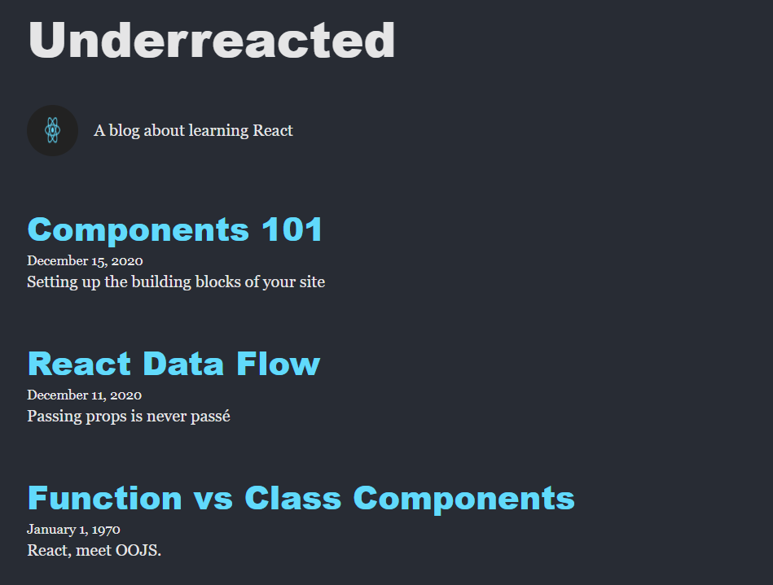

# Personal Blog React App

A simple personal blog application built with React. This project demonstrates
core React concepts including component hierarchy, props, JSX, and rendering
lists with `.map()`.

## Features

- Reusable React components
- Props-based data flow
- Dynamic article rendering
- Accessible image support
- Default prop values
- Component-based project structure

## Technologies Used

- React
- JavaScript (ES6)
- JSX
- Vite

## Project Structure

```txt
src/
├── assets/
├── components/
│   ├── App.jsx
│   ├── Header.jsx
│   ├── About.jsx
│   ├── ArticleList.jsx
│   └── Article.jsx
├── data/
│   └── blog.js
└── main.jsx
```

## Component Hierarchy

```txt
App
├── Header
├── About
└── ArticleList
    └── Article
```

## Running the Project

Install dependencies:

```bash
npm install
```

Start the development server:

```bash
npm run dev
```

Open the localhost URL displayed in the terminal.

## Screenshots



## Learning Objectives

This project was created to practice:

- Creating React components
- Passing props between components
- Rendering dynamic lists
- Using default props
- Organizing component-based applications

## Author

Matthew Swanberg